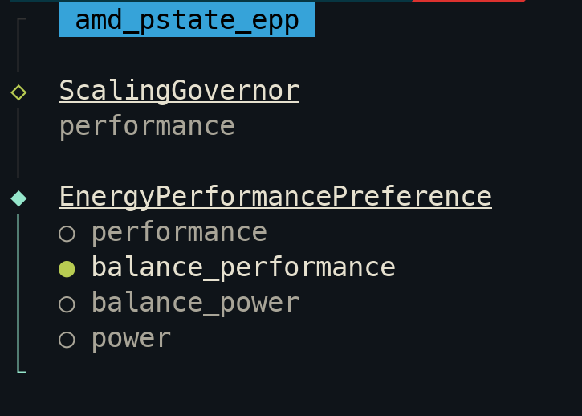
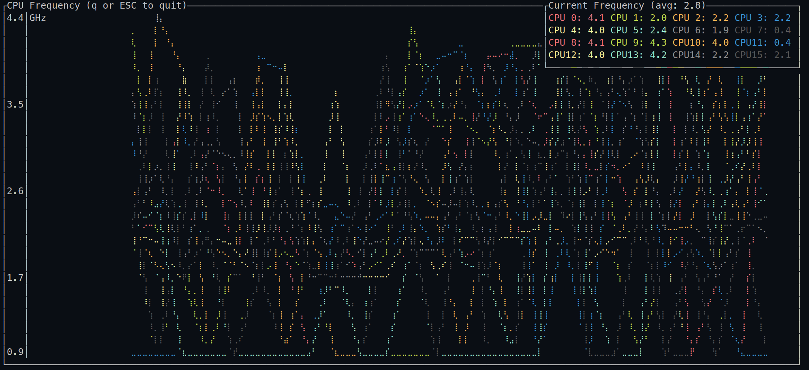

# amd_epp_tool AMD pstate CPU Performance Scaling

This small tool is a simple CLI and TUI to configure the `scaling_governor` and `energy_performance_preference` settings 
exposed in `sysfs` by the Linux `amd_pstate_epp` driver. It sets the same profile uniformly across all CPUs. 

 

 

## Usage

It has 4 commands, note that making a configuration change requires `root` access.

```
Read or change the amd_pstate_epp kernel driver settings

Usage: amd-epp-tool [COMMAND]

Commands:
  ui    interactive settings UI (default)
  get   get the current settings
  set   set new settings
  mon   CPU Frequency monitor graph
  help  Print this message or the help of the given subcommand(s)

Options:
  -h, --help     Print help
  -V, --version  Print version
```

## Installation

### Linux

The latest release can be "installed" by placing it in your user path `$HOME/.local/bin/` and made setuid root as such:

```bash
curl -L https://github.com/jayv/amd-epp-tool/releases/latest/\
download/amd-epp-tool-x86_64-unknown-linux-gnu.tar.gz | tar zxv -C $HOME/.local/bin/

# make it setuid root to change settings (optional) 
sudo chown root $HOME/.local/bin/amd-epp-tool
sudo chmod +s $HOME/.local/bin/amd-epp-tool
```

Alternative installation (global path, use `sudo` when changing settings):

```bash
curl -L https://github.com/jayv/amd-epp-tool/releases/latest/\
download/amd-epp-tool-x86_64-unknown-linux-gnu.tar.gz | sudo tar zxv -C /usr/local/bin/
```

### Other Operating Systems

This tool is only for the Linux `amd_pstate_epp` driver, sorry.

## Gotchas

This tool is built specifically to work with the `amd_pstate_epp` driver in `active` mode, which was introduced in Linux 6.3 or available as a patch against 5.x if you compiled your own kernel.

The allowed combination of `scaling_governor` and `energy_performance_preference (epp)` settings is dictated by the driver, if you receive a `device or resource busy` message, that usually means you've chosen an invalid configuration combination, eg. mixing performance and power-saving: 
```
> amd-epp-tool set -s=performance -e=power
Failed to save configuration, perhaps you need ROOT access
Error Device or resource busy (os error 16)
```

The tool doesn't prevent partial updates. If it fails to apply a setting, which usually means some incompatible `energy_performance_preference` combination which got rejected, it may have already updated your `scaling_governor`. It makes no effort to roll back to the prior state. 

## References

- [Linux amd-pstate CPU Performance Scaling](https://docs.kernel.org/admin-guide/pm/amd-pstAate.html)

- [Arch Linux CPU Frequency Scaling Wiki](https://wiki.archlinux.org/title/CPU_frequency_scaling) 

- [Phoronix coverage of amd_pstate_epp](https://www.phoronix.com/review/amd-pstate-epp-ryzen-mobile) 
